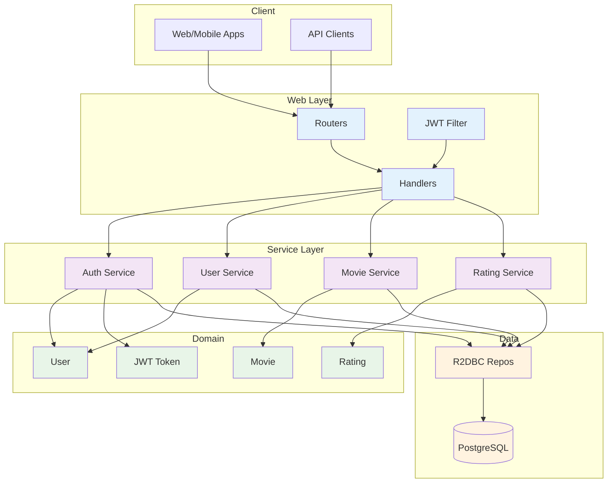
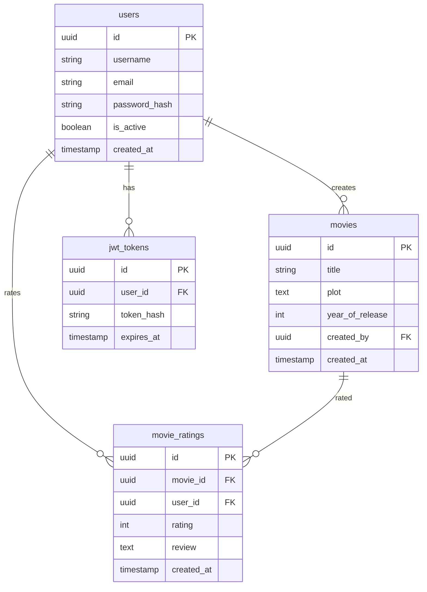
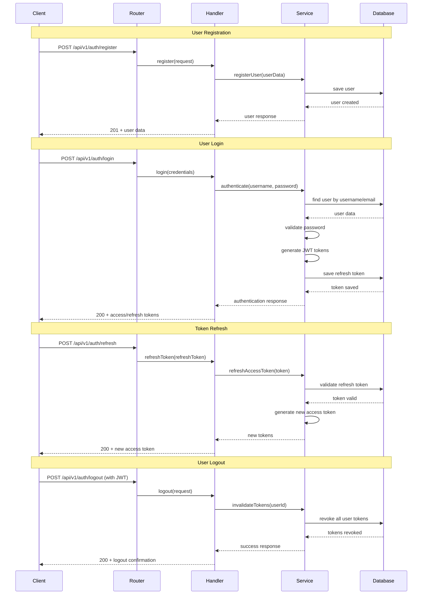
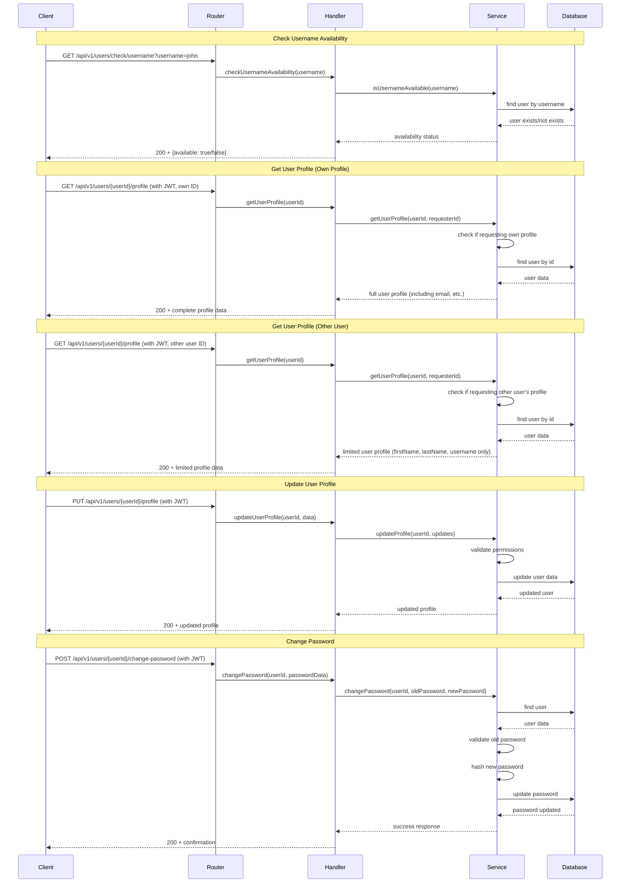
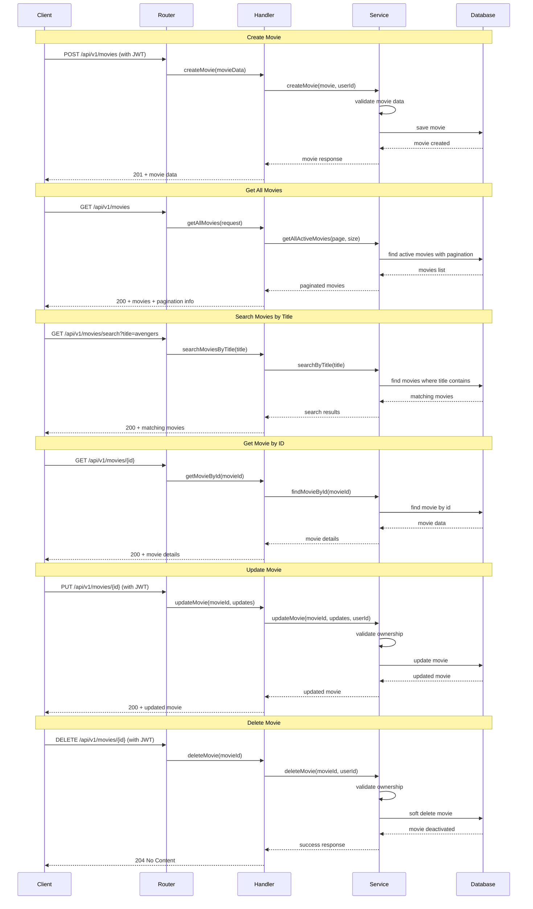
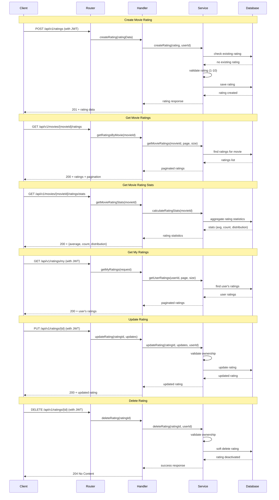
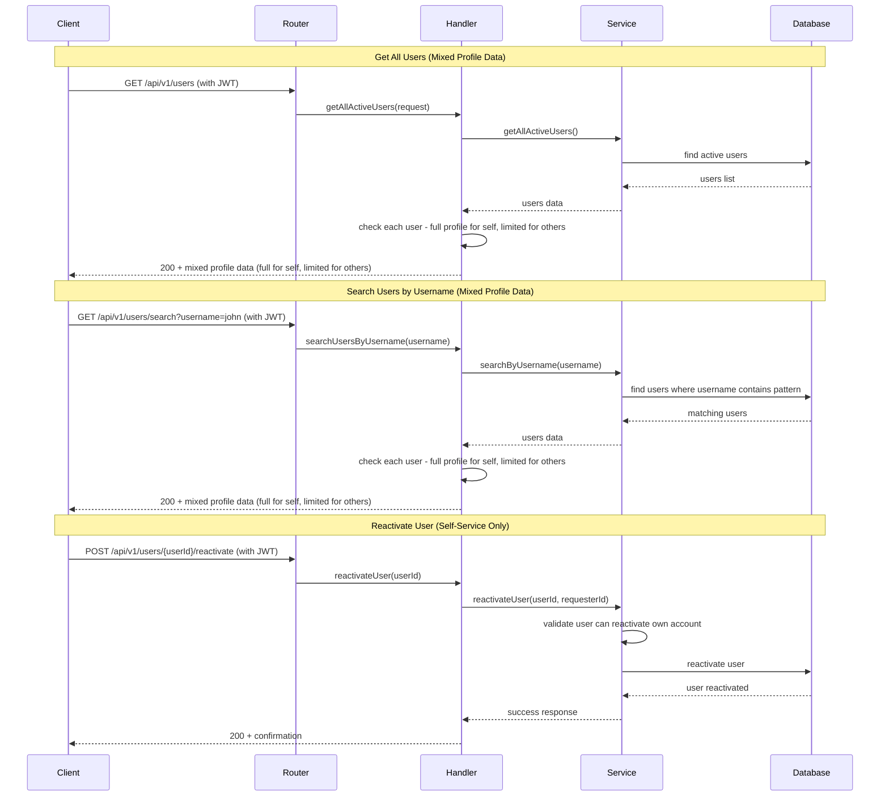

# Movie Rating System - Simplified Architecture

## Overview
Reactive Spring Boot application with Clean Architecture, providing movie rating APIs with JWT authentication.

## System Architecture

## Data Model

## API Workflows

### Authentication Flows

### User Management Flows

### Movie Management Flows

### Movie Rating Flows

### User Management Flows (Public Discovery)

> **TODO**: Admin-specific workflows (user role management, admin-only operations) are not fully implemented due to time constraints. The current implementation treats all authenticated users equally for user discovery features. In a production system, admin roles would control access to user management operations.

## Tech Stack
- **Framework**: Spring Boot 3.5 + WebFlux
- **Database**: PostgreSQL + R2DBC
- **Security**: JWT + BCrypt
- **Docs**: OpenAPI/Swagger
- **Build**: Maven + Java 21

## Key Features
- ✅ Reactive programming
- ✅ Clean architecture
- ✅ JWT authentication
- ✅ User management
- ✅ Movie CRUD
- ✅ Rating system
- ✅ API documentation

## Implementation Notes

### Completed Features
- ✅ User authentication with JWT (access/refresh tokens)
- ✅ User registration and profile management
- ✅ Movie CRUD operations with ownership validation
- ✅ Movie rating system with duplicate prevention
- ✅ Privacy-aware user profile access (full for self, limited for others)
- ✅ Reactive programming with Spring WebFlux
- ✅ Clean architecture with domain-driven design
- ✅ Comprehensive API documentation with OpenAPI/Swagger
- ✅ Database migrations with Flyway
- ✅ Unit and integration tests

### TODO / Not Implemented (Time Constraints)
- ❌ **Admin Role System**: No role-based access control implemented
  - All authenticated users have same permissions
  - Admin-specific endpoints exist but don't enforce admin roles
  - Future: Implement User roles (ADMIN, USER) with proper authorization
- ❌ **Caching Layer**: No Redis/cache implementation for performance
  - Movie ratings, user profiles could benefit from caching
  - Future: Add Redis for frequently accessed data
- ❌ **Advanced Search**: Basic search only
  - Movie search by genre, rating range, actor not implemented
  - User search only by username pattern
  - Future: Implement Elasticsearch or advanced SQL queries
- ❌ **Pagination**: Limited pagination support
  - Some endpoints return all results without pagination
  - Future: Implement consistent pagination across all list endpoints
- ❌ **Rate Limiting**: No API rate limiting implemented
  - Future: Add rate limiting to prevent abuse
- ❌ **Email Notifications**: No email service integration
  - Future: Send welcome emails, password reset notifications
- ❌ **Audit Logging**: Basic logging only, no audit trail
  - Future: Implement comprehensive audit logging for all operations
