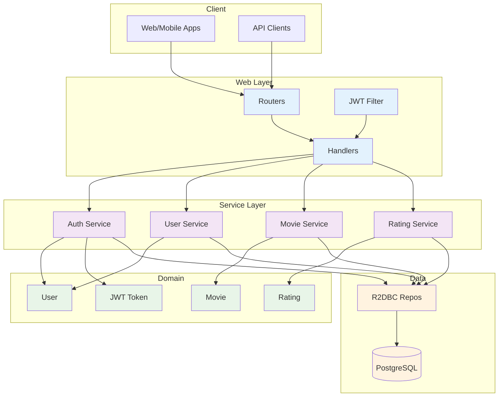
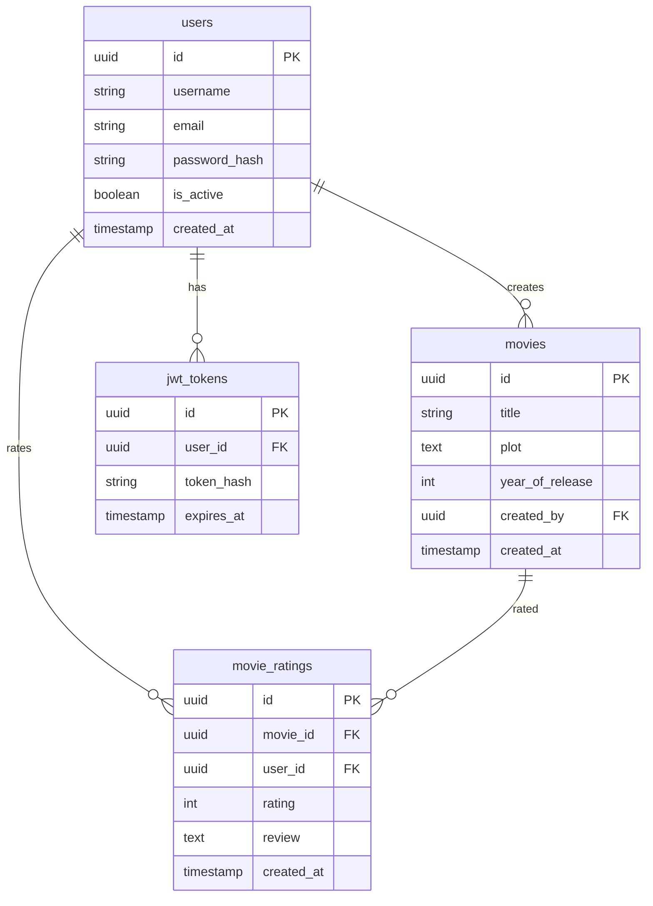
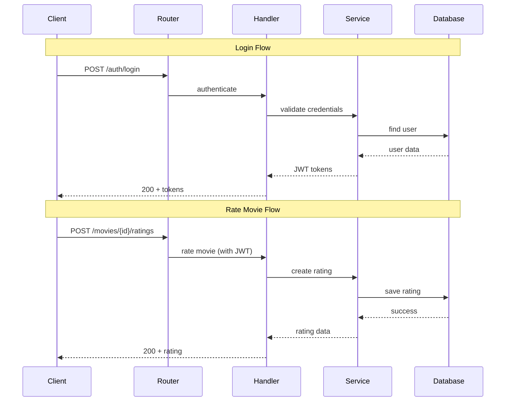

# Movie Rating System - Simplified Architecture

## Overview
Reactive Spring Boot application with Clean Architecture, providing movie rating APIs with JWT authentication.

## System Architecture

## Data Model

## API Flow

## Tech Stack
- **Framework**: Spring Boot 3.5 + WebFlux
- **Database**: PostgreSQL + R2DBC
- **Security**: JWT + BCrypt
- **Docs**: OpenAPI/Swagger
- **Build**: Maven + Java 21

## Key Features
- ✅ Reactive programming
- ✅ Clean architecture
- ✅ JWT authentication
- ✅ User management
- ✅ Movie CRUD
- ✅ Rating system
- ✅ API documentation
